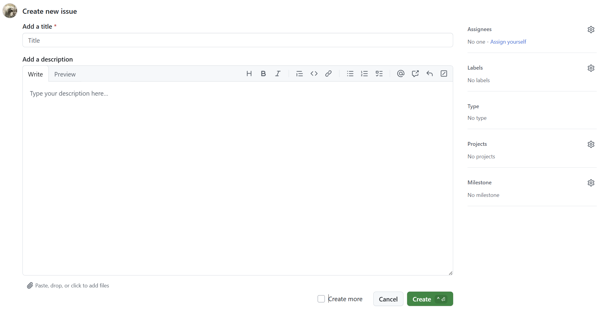
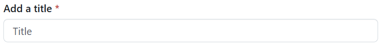
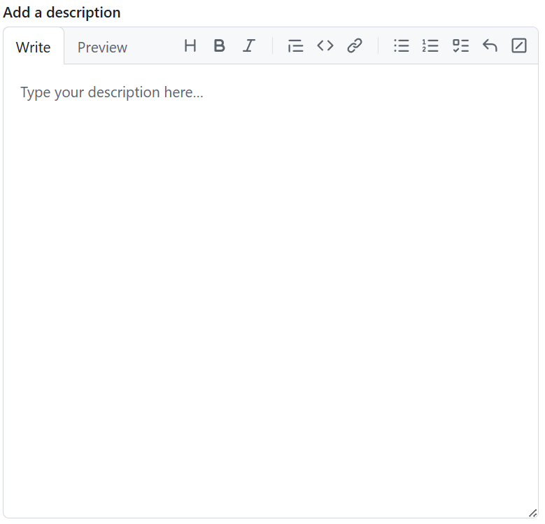
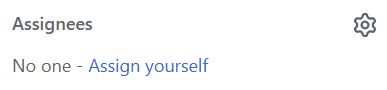
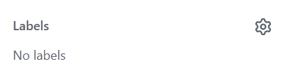
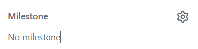

# Making an issue

## Intro: Why should I make an issue?

### By making issues...

It allows for:

- Easy viewing of what needs to get done
- The organization of tasks
- Assigning of work to people on the GitHub website

### When all the elements come together...

Maintaining the work needed to be done between a group of people is a lot easier!

### And in terms of this repository...

Feel free to put any requests in the issues tab! 

I'll do my best to keep an eye on the tab, so if you want help in any specific area, feel free to let me know!

## Let's make an issue!

[If you click this,](https://github.com/EdwardLe0n/KnowledgeTime/issues) you should be directed to the GitHub website for this repository and see something like this!

To start out, click the green button that says 'New Issue', which should link to a page that looks like this!

Then from here, we see a variety of things!

### To give a bit of an explanation of the common elements in the issue windows here...

#### Add a title

Every issue needs a title! This should be a quick sentence to let someone know what the issue may generally entail

#### Add a description

This is where most of the info should be in terms of requests! 

Make this section as long as it needs to be, as the more data in regards to what is needed, the better!

However, only make it as long as it needs to be! So just have the necessary into with some extra info, as people may not be willing to read essays

#### Assignees

This will allow users to place tasks on certain individuals that are collaborators on the repository!

In this repo, I may just use it to display what is actively getting worked on, but I'd recommend using it heavily when it comes to personal projects, especially with teams.

#### Labels

This is a solid way to organize issues by giving them ways to filter based on what is required

For instance, if there needs to be some more clarification on some code, I'd list toss on a documentation tab. 
On the other hand, if someone is requesting some help with getting work done in terms of script, I'd mark that under a relevant scripting tag.

#### Milestones

