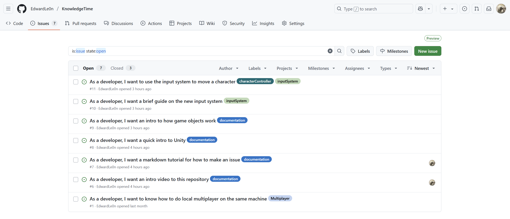

# Making an issue

## Intro: Why should I make an issue?

### By making issues...

It allows for:

- Easy viewing of what needs to get done
- The organization of tasks
- Assigning of work to people on the GitHub website

### When all the elements come together...

Maintaining the work needed to be done between a group of people is a lot easier!

### And in terms of this repository...

## Let's make an issue!

